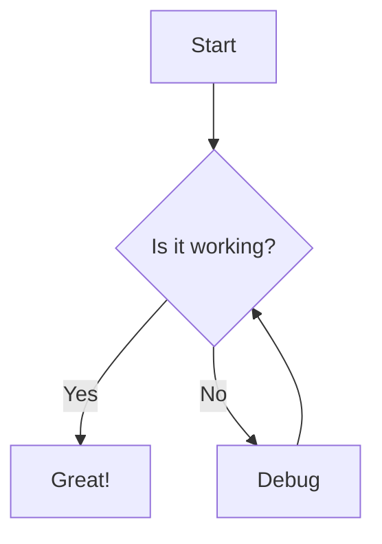

# Sample Toy Project

This project demonstrates how to visualize flows.

## Architecture

Here is a simple flow chart explaining the logic:

```mermaid
graph TD;
    A[Start] --> B{Is it working?};
    B -- Yes --> C[Great!];
    B -- No --> D[Debug];
    D --> B;
```

## Features

- Feature 1
- Feature 2
